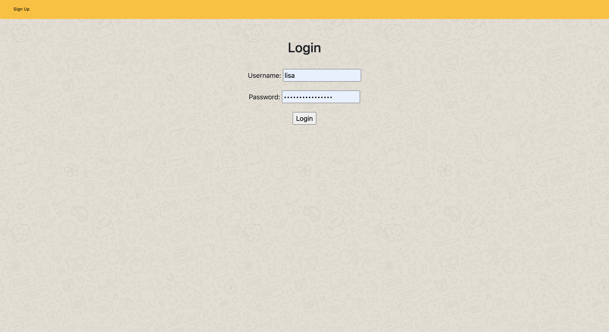
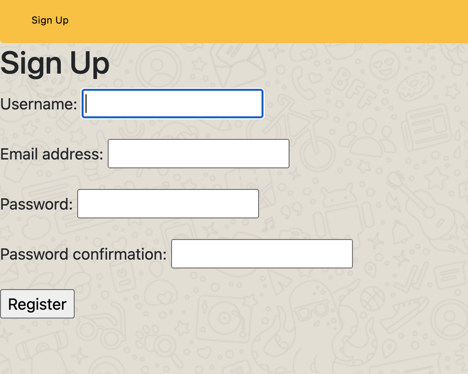
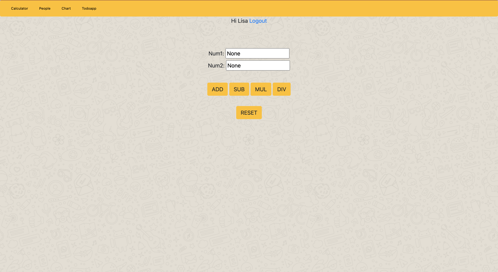
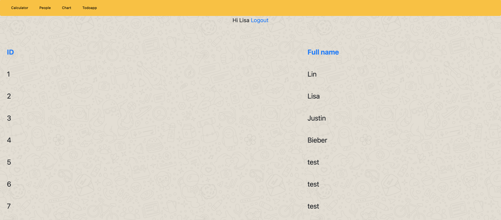
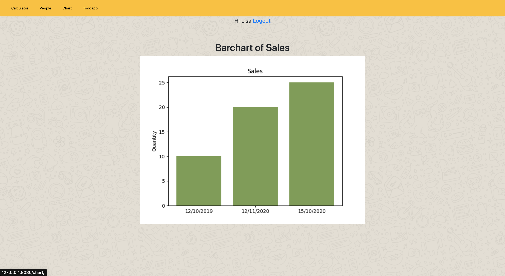
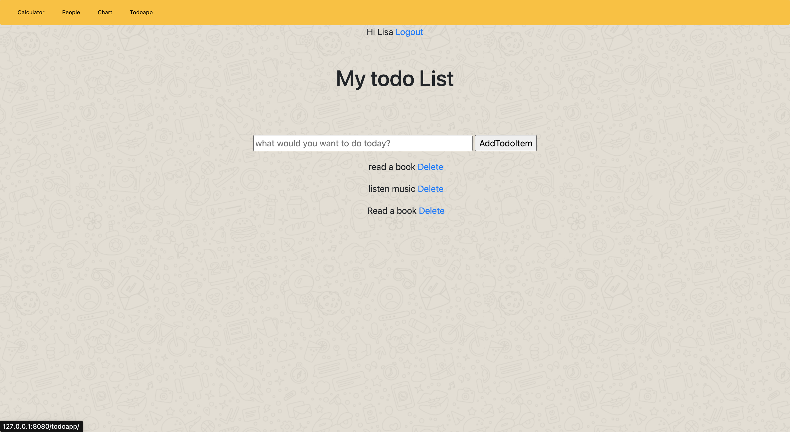
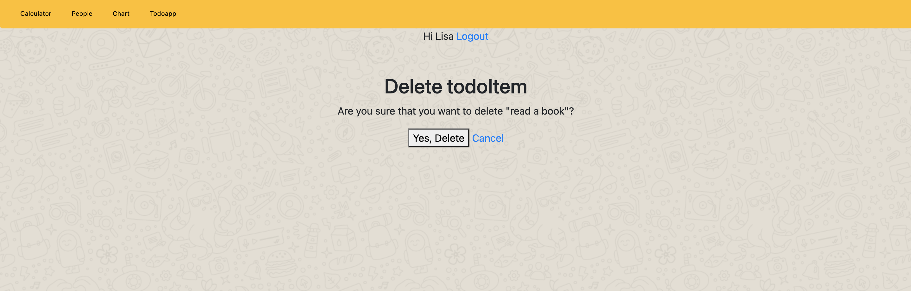

# My calculator

----------------------------------------------------------------------

## Overview
- [Goal](#goal)
- [Implementation](#implementation)


----------------------------------------------------------------------

## Goal
This project is a simple application that contains a table, a chart dashboard and a todolist app based on Django framework.

----------------------------------------------------------------------


## Implementation
 
 This application contains a registration system, in order to use the following functionalities, the user must register or log at first.
 </br>
 _user: lisa_
 </br>
 _password:lisalisalisalisa_
  </br>
 </br>
 

 _login_




_sign up_
### Calculator

When you click the **calculator** tab in the navigator bar, it will navigate to the calculator.




_simple calculator_

----------------------------------------------------------------------

### Person

Person table django-tables2 to create HTML tables.
User can add entry in **personView.py** with following:

```python
PersonList.objects.create(name='test1')
```
*test1* is a dummy content of table, in order to add PersonList in table, we have created a model named **PersonList** in **models.py**

```python
class PersonList(models.Model):
    name = models.CharField(max_length=100, verbose_name="full name")
```



_persontable_
### Chart
When you click the **Chart** tab in navigator bar, it will navigates to the barchart.



_barchart_

### Todoapp

When you click the **Todoapp** tab in navigator bar, it will navigates to the Todo app.

User can add and delete the event, the events are stored in database, the events will be loaded every time when run the server. 



_todoapp_




_delete todoitem_


### add admin user via terminal
```
 python manage.py createsuperuser
```
```
Username: admin
```
```
Email address: admin@example.com
```
```
Password: **********
Password (again): *********
Superuser created successfully.
```
More info please view [django admin](https://docs.djangoproject.com/en/1.8/intro/tutorial02/)


The existed admin account:
```
Username: lisalin
Password: lys220130
```
----------------------------------------------------------------------

# Todo : #

Integrate `sqlite3` `student` with the application, add CURD operations for student table.


