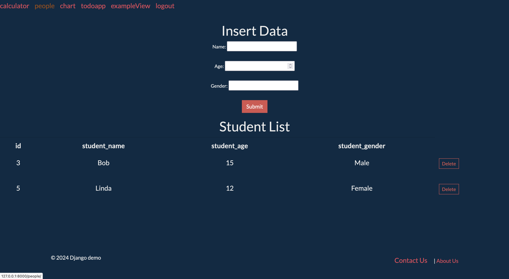

#     Calculator-Django

This project is a straightforward Django web application that uses MySQL as its database management system. It includes essential features such as an authorization system, a calculator, a student records table, a chart dashboard, and a to-do list.

1. **Prerequisites**
   - `Django`
   - `Python3.9`
   - `Django_tables2`
   - `Matplotlib`
   - `termcolor` 
   - `Django-clearcache`

2. **Clone the repository** 
  `git clone git@github.com:Lisalin5813010/Django_Project.git`
3. **Create and activate a virtual environment (optional but recommended)**

## Usage
- Login System
    
- Calculator
    
- Student table
    
- Charts
    
- TodoList
    

5. **Run the development server** 
`python3.9 manage.py runserver`
